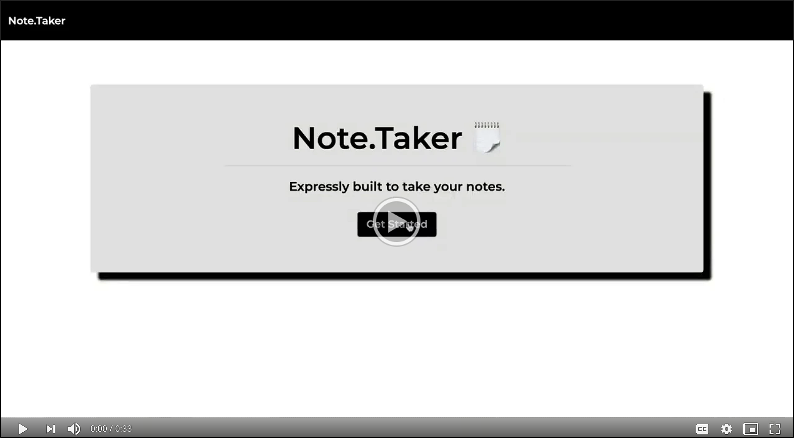
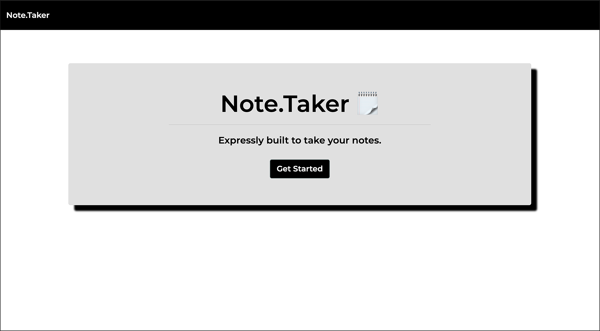
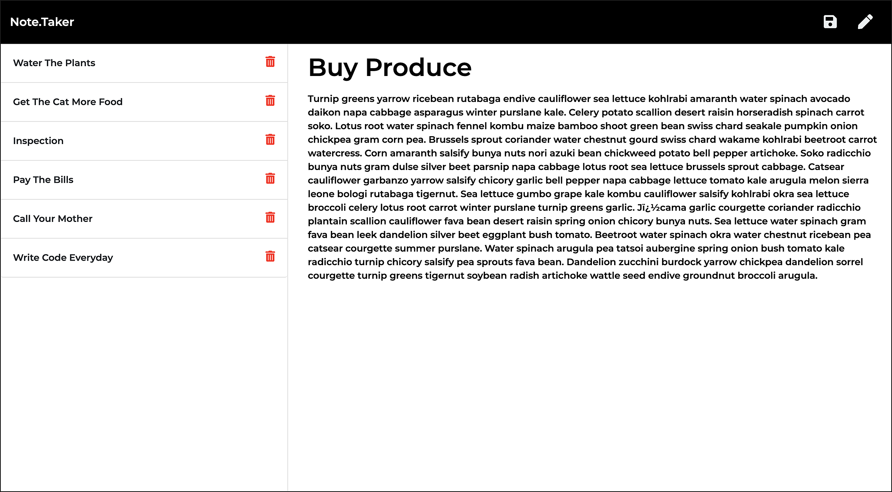
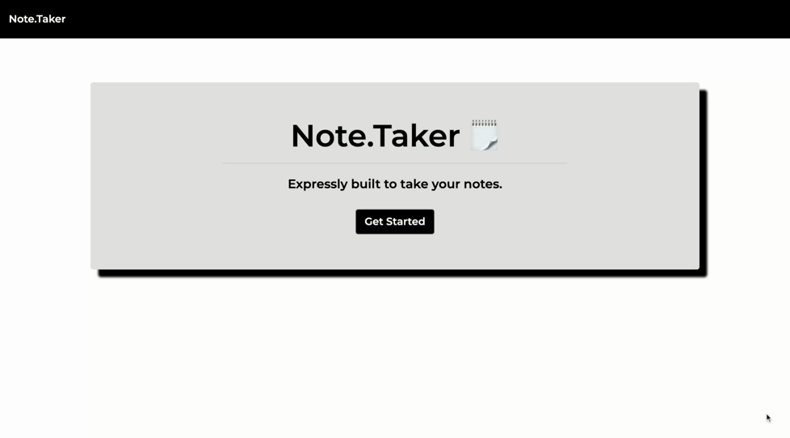

# Note.Taker: ‏‏‎ ‎Expressly built to take your notes.‏‏‎
‎‎ 
  

  ---
  
  
&nbsp;

    

## Description 

&nbsp;

<strong><em>What is this project? Why did you make this project? How did you make this project?</strong></em>

&nbsp;

This is another take on a classic application that we all use on a daily basis. A digital notepad. It does exactly what you would imagine it does. You are able to author notes, save them, revisit them at a later time, and delete them when those thoughts aren't needed any longer. Never forget items on your grocery list again. List your monthly bills and check them off once you've paid them all. Record your thoughts when that next big idea comes to mind. It's your call. This application utilizes `Node.js` and more specifically `Express.js` for backend saving and retreiving of note information. It has been optimized for usage on all devices, and will store data entries indefinitely. 

&nbsp;

Use the Note.Taker application here =>‏‏‎ ‎‏‏‎ ‎‏‏‎ ‎‏‏‎[` Note.Taker `](https://note-taker-express-js.herokuapp.com/)

&nbsp;

---

&nbsp;

## Table of Contents: 

&nbsp;

* [Usage](#usage)
* [License](#license)
* [Credits](#credits)
* [Questions](#questions)

&nbsp;

---

&nbsp;

## Usage

&nbsp;

<strong><em>Instructions and examples for usage:</strong></em>

&nbsp;

Quite simply: Launch the browser based application, and begin adding your notes!

&nbsp;

View a video overview on usage here:

 

&nbsp;

---

&nbsp;

&nbsp;

&nbsp;

&nbsp;

---

&nbsp;

<kbd>

  

</kbd>

&nbsp;

---

&nbsp;

## License

&nbsp;

This project is covered under the MIT license. 

&nbsp;

---

&nbsp;

## Credits

&nbsp;

<strong><em>Third party assets:</strong></em>

&nbsp;

`Node.js` =>‏‏‎ ‎ ‏‏‎ ‎[An asynchronous event-driven runtime built on Chrome's V8 JavaScript engine.](https://nodejs.org/en/)

&nbsp;‏‏‎‏‏‎ ‎<strong>+</strong>

`Express.js` =>‏‏‎ ‎ ‏‏‎ ‎[A fast, unopinionated, minimalist web framework for Node.js](https://expressjs.com/)

&nbsp;‏‏‎‏‏‎ ‎<strong>+</strong>

`Heroku` =>‏‏‎ ‎ ‏‏‎ ‎[A platform that enables developers to build, run, & operate applications entirely in the cloud.](https://www.heroku.com)

&nbsp;

---

&nbsp;

## Questions?

&nbsp;

Shoot me an e-mail! => jonathan@jonathanschimpf.com

&nbsp;

Check out more of my work here on =>
[GitHub](http://github.com/jonathanschimpf)

&nbsp;

